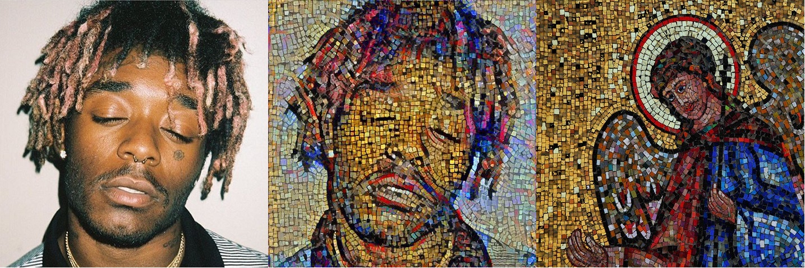
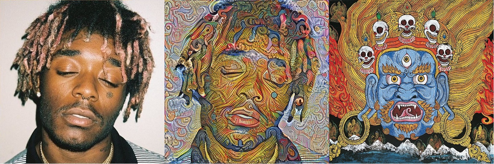

# Artistic-style-transfer-using-the-VGG-19-convolutional-neural-network

The goal of this project was to create and understand the algorithm used for a computer to learn the style and patterns created by an artist and transfer them to a chosen image. The algorithm uses a pretrained deep convolutional neural network, VGG-19, to create neural representations of the style/patterns of the artwork and the features of the chosen content image, from which you can embedd the style/pattern on to the features of the content image. The real life image used was the face of the rapper [Lil Uzi Vert](https://en.wikipedia.org/wiki/Lil_Uzi_Vert) and the artwork used was a [mosaic](https://en.wikipedia.org/wiki/Mosaic) and [thangka](https://en.wikipedia.org/wiki/Thangka)(Tibetan Buddhist painting). We will apply the methods used in the paper ["A Neural Algorithm of Artistic Style"](https://arxiv.org/pdf/1508.06576.pdf) by Gatys et al. There were several parameters in this algorithm that were chosen to create the desired results, an investigation was made to provide an explanation of how they work to optimize the "style transfer". The final results are shown below.

